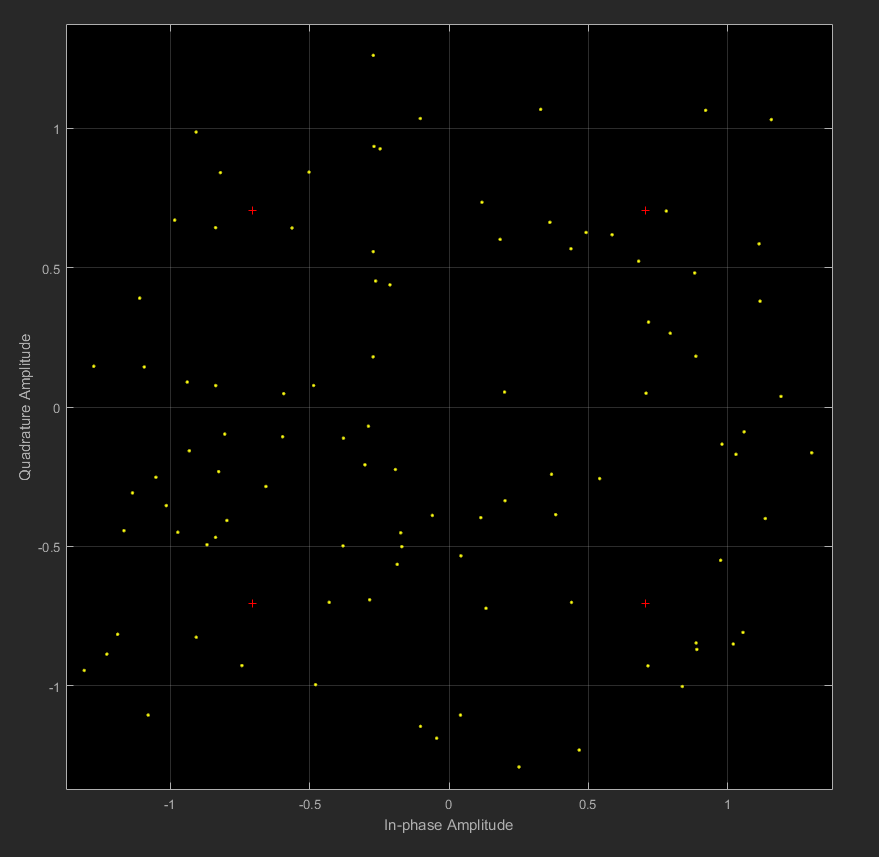

# Digital Communications Matlab Simulink Project. ELC325

# List of required modulation schemes
- **[BPSK](#BPSK-Binary-Phase-Shift-Keying)**
- **[QPSK](#QPSK-Quadrature-phase-shift-keying)**
- **[FSK](#FSK-Frequency-shift-keying)**
- **[QAM16](#QAM16-Quadrature-amplitude-modulation)**
- **[QAM64](#QAM64-Quadrature-amplitude-modulation)**

# Common steps for reproducing the images
    - Open Matlab
    - Press the command "Simulink"
    - Open the requested .slx file
    - In Matlab press the command "Bertool"
    - Load the requested .ber file
    - run from Bertool 

# PSK Phase Shift Keying
Phase-shift keying PSK is a digital modulation process which conveys data by modulating the phase of a constant frequency reference signal. The modulation is accomplished by varying the sine and cosine inputs at a precise time.

Any digital modulation scheme uses a finite number of distinct signals to represent digital data. PSK uses a finite number of phases, each assigned a unique pattern of binary digits. Usually, each phase encodes an equal number of bits. Each pattern of bits forms the symbol that is represented by the particular phase.

The demodulator, which is designed specifically for the symbol-set used by the modulator, determines the phase of the received signal and maps it back to the symbol it represents, thus recovering the original data. This requires the receiver to be able to compare the phase of the received signal to a reference signal.

# BPSK Binary Phase Shift Keying
#### 1 - Brief explanantion
BPSK is the simplest form of phase shift keying **[PSK](#PSK-:-Phase-Shift-Keying)**. It uses two phases which are separated by 180° and so can also be termed 2-PSK. It does not particularly matter exactly where the constellation points are positioned, and in the figure below they are shown on the real axis, at 0° and 180°. Therefore, it handles the highest noise level or distortion before the demodulator reaches an incorrect decision. It is, however, only able to modulate at 1 bit/symbol and so is unsuitable for high data-rate applications.

In the presence of an arbitrary phase-shift introduced by the communications channel, the demodulator is unable to tell which constellation point is which. As a result, the data is often differentially encoded prior to modulation.

#### 2 - How to reproduce figures
**[Check general steps](#Common-steps-for-reproducing-the-images)**

#### 3A - A scatter plot of the symbols before noise.

#### 3B - A scatter plot of the symbols after noise.

#### 4 - BER performance figure.

# QPSK Quadrature phase-shift keying
#### 1 - Brief explanantion
QPSK uses four points on the constellation diagram, equispaced around a circle. With four phases, QPSK can encode two bits per symbol, shown in the diagram with Gray coding to minimize the bit error rate (BER) – sometimes misperceived as twice the BER of BPSK.

The mathematical analysis shows that QPSK can be used either to double the data rate compared with a BPSK system while maintaining the same bandwidth of the signal, or to maintain the data-rate of BPSK but halving the bandwidth needed. In this latter case, the BER of QPSK is exactly the same as the BER of BPSK – and deciding differently is a common confusion when considering or describing QPSK. The transmitted carrier can undergo numbers of phase changes.

#### 2 - How to reproduce figures
**[Check general steps](#Common-steps-for-reproducing-the-images)**

#### 3A - A scatter plot of the symbols before noise.

#### 3B - A scatter plot of the symbols after noise.

#### 4 - BER performance figure.

# FSK Frequency shift keying
#### 1 - Brief explanantion
Frequency-shift keying is a frequency modulation scheme in which digital information is transmitted through discrete frequency changes of a carrier signal. The technology is used for communication systems such as telemetry, weather balloon radiosondes, caller ID, garage door openers, and low frequency radio transmission in the VLF and ELF bands. 

#### 2 - How to reproduce figures
**[Check general steps](#Common-steps-for-reproducing-the-images)**

#### 3A - A scatter plot of the symbols before noise.

#### 3B - A scatter plot of the symbols after noise.

#### 4 - BER performance figure.

# QAM16 Quadrature amplitude modulation
#### 1 - Brief explanantion
Quadrature amplitude modulation (QAM) is the name of a family of digital modulation methods and a related family of analog modulation methods widely used in modern telecommunications to transmit information. It conveys two analog message signals, or two digital bit streams, by changing (modulating) the amplitudes of two carrier waves, using the amplitude-shift keying (ASK) digital modulation scheme or amplitude modulation (AM) analog modulation scheme. The two carrier waves of the same frequency are out of phase with each other by 90°, a condition known as orthogonality and as quadrature. Being the same frequency, the modulated carriers add together, but can be coherently separated (demodulated) because of their orthogonality property. Another key property is that the modulations are low-frequency/low-bandwidth waveforms compared to the carrier frequency, which is known as the narrowband assumption.

#### 2 - How to reproduce figures
**[Check general steps](#Common-steps-for-reproducing-the-images)**

#### 3A - A scatter plot of the symbols before noise.

#### 3B - A scatter plot of the symbols after noise.

#### 4 - BER performance figure.

# QAM64 Quadrature amplitude modulation
#### 1 - Brief explanantion

#### 2 - How to reproduce figures
**[Check general steps](#Common-steps-for-reproducing-the-images)**

#### 3A - A scatter plot of the symbols before noise.

#### 3B - A scatter plot of the symbols after noise.

#### 4 - BER performance figure.

**`Wikipedia was used in the research`**