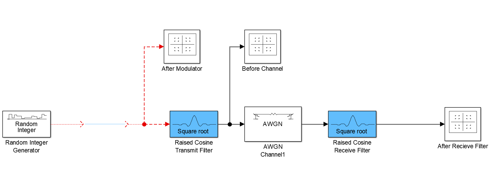

# Raised Cosine bonus

# List of required modulation schemes
- **[BPSK](#BPSK-Binary-Phase-Shift-Keying)**
- **[QPSK](#QPSK-Quadrature-phase-shift-keying)**
- **[FSK](#FSK-Frequency-shift-keying)**
- **[QAM16](#QAM16-Quadrature-amplitude-modulation)**
- **[QAM64](#QAM64-Quadrature-amplitude-modulation)**

# General Scheme
    just different block for each scheme

# BPSK Binary Phase Shift Keying
## After Modulator

## After Modulator

## After Reciever

# QPSK Quadrature phase shift keying

## After Modulator

## After Modulator

## After Reciever

# FSK Frequency shift keying

## After Modulator

## After Modulator

## After Reciever

# QAM16 Quadrature amplitude modulation

## After Modulator

## After Modulator

## After Reciever

# QAM64 Quadrature amplitude modulation

## After Modulator

## After Modulator

## After Reciever

#### Refrences:
https://www.mathworks.com/help/comm/ug/filter-using-simulink-raised-cosine-filter-blocks.html?fbclid=IwAR3Xu2_ZgBEm2Q08Cu3tKDj-UzaLIz3nFKxNjiEPBVjVNqoviO-5BePcXAo

The matlab model doc_rrcfiltercompare that can be loaded by typing the following at the MATLAB command line.

    `doc_rrcfiltercompare`